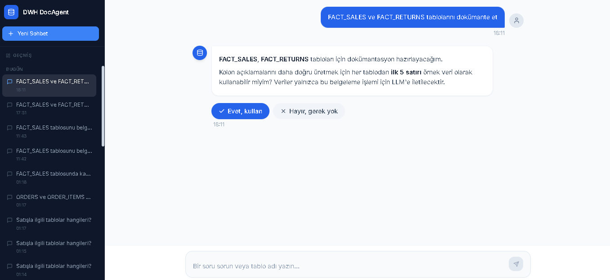
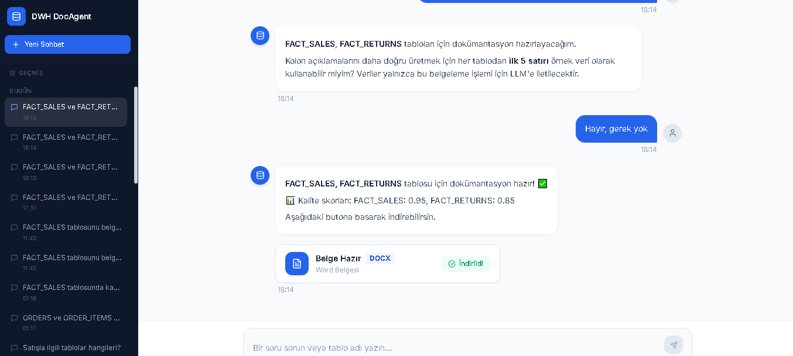

# DWH DocAgent
https://github.com/user-attachments/assets/3578bf9a-4bcf-4e6d-b0a7-8138651b68f8


An AI-powered documentation assistant for Oracle data warehouses. Chat with your DWH in Turkish (or English), get instant table insights, and generate professional DOCX/PDF documentation — all with a consent-gated data privacy model.

---

*Chat interface: a documentation request triggers a consent prompt before any sample data is touched.*


*Document generation: once approved, the generated DOCX is ready to download with quality scores shown inline.*

## Table of contents

- [What it does](#what-it-does)
- [Architecture](#architecture)
- [Tech stack](#tech-stack)
- [Privacy model](#privacy-model)
- [Getting started](#getting-started)
- [Testing](#testing)
- [Project structure](#project-structure)
- [API endpoints](#api-endpoints)
- [Observability](#observability)
- [Design decisions](#design-decisions)
- [Known limitations](#known-limitations)
- [License](#license)
- [Contact](#contact)

## What it does

| Intent | Example | Response |
|--------|---------|----------|
| **Discover** | "Satışla ilgili tablolar hangileri?" | Lists relevant tables with descriptions |
| **Table info** | "DIM_CUSTOMER tablosu ne içeriyor?" | Schema summary + row count, no LLM data exposure |
| **Document** | "FACT_SALES ve DIM_PRODUCT tablolarını belgele" | Consent prompt → DOCX/PDF with schema, lineage, and cross-table relationships |
| **Chitchat** | "Merhaba, ne yapabilirsin?" | Conversational response |

Conversation context is preserved across turns (SQLite-backed, 7-day retention), so follow-up questions like "bu tabloda kaç satır var?" resolve correctly.

---

## Architecture

```
User message
     │
     ▼
┌─────────────────┐
│  intent_parser  │  GPT-4o structured output → chitchat / discovery /
│                 │  table_info / document / consent_yes / consent_no
└────────┬────────┘
         │
         ▼
┌─────────────────┐
│  consent_gate   │  document → ask for sample data consent
│                 │  other    → pass through
└────────┬────────┘
         │
    ┌────┴────────────────────┬───────────────────┐
    ▼                         ▼                   ▼
┌──────────────┐    ┌──────────────────┐   ┌────────────────┐
│table_discovery│   │   table_info     │   │ schema_analyst │
│ (list + LLM) │   │ (schema + stats) │   │   lineage_agent│
└──────┬───────┘   └────────┬─────────┘   │   doc_writer   │
       │                    │             │ quality_checker │
       ▼                    ▼             └───────┬────────┘
      END                  END          score<0.7 │ retry<MAX
                                                  └──► doc_writer
                                                  score≥0.7 ▼
                                                           END
```

**MCP tools** (via FastMCP, defined in `oracle_mcp/`) used inside the pipeline:
- `schema_reader` — column types, constraints, existing Oracle comments
- `dep_tracer` — FK chains, view/procedure dependencies, implicit ID-column relations
- `sample_fetcher` — actual row samples (only fetched after explicit user consent)
- `table_lister` — all accessible tables with comments
- `table_search` — keyword search over table names and comments
- `ddl_audit` — recent DDL changes

---

## Tech stack

| Layer | Technology |
|-------|-----------|
| Agent pipeline | LangGraph 1.2 (`StateGraph`) |
| LLM | GPT-4o (structured outputs via `openai.beta.chat.completions.parse`) |
| MCP tools | FastMCP (read-only Oracle access) |
| Backend API | FastAPI + Pydantic (RFC 7807 error format) |
| Database | Oracle DB via `oracledb` (thick mode) |
| Conversation memory | SQLite (7-day retention) |
| Output formats | DOCX (`python-docx`), PDF (`reportlab`) |
| Observability | OpenTelemetry — console or OTLP (Jaeger/Zipkin) |
| Resilience | Circuit breaker + exponential retry (`tenacity`) |
| Frontend | React 18 + TypeScript + Tailwind CSS |

---

## Privacy model

Real data rows **never** reach the LLM unless the user explicitly consents per-session:

```
"FACT_SALES tablosunu belgele"
 → "Kolon açıklamalarını iyileştirmek için ilk 5 satırı kullanabilir miyim? [Evet / Hayır]"
     │
     ├── Evet → sample rows included in doc_writer prompt
     └── Hayır → schema + statistics only (num_rows from all_tables, no actual data)
```

Row count queries (`table_info`) read only `num_rows` from `all_tables` — zero real rows fetched.

---

## Getting started

### Prerequisites

- Python 3.11+
- Oracle Instant Client ([download](https://www.oracle.com/database/technologies/instant-client/downloads.html))
- Oracle DB access credentials
- OpenAI API key

### Backend setup

```bash
git clone https://github.com/haticeetan/dwh-doc-agent.git
cd dwh-doc-agent

pip install -r requirements.txt
pip install -e .          # projeyi editable modda yükle (import yolları için)

cp .env.example .env
# Fill in DB_USER, DB_PASSWORD, DB_HOST, DB_SERVICE, ORACLE_CLIENT_LIB, OPENAI_API_KEY

python main.py
# API runs at http://localhost:8000
```

### Frontend setup

```bash
cd frontend
npm install
npm run dev
# UI runs at http://localhost:5173
```

### Environment variables

| Variable | Description |
|----------|-------------|
| `DB_USER` | Oracle username |
| `DB_PASSWORD` | Oracle password |
| `DB_HOST` | Oracle host / IP |
| `DB_PORT` | Oracle port (default: 1521) |
| `DB_SERVICE` | Oracle service name (or use `DB_SID`) |
| `ORACLE_CLIENT_LIB` | Path to Oracle Instant Client directory |
| `OPENAI_API_KEY` | OpenAI API key |
| `LOG_LEVEL` | `DEBUG` / `INFO` / `WARNING` (default: `INFO`) |
| `OTEL_EXPORTER` | `console` (default) or `otlp` |
| `OTEL_EXPORTER_OTLP_ENDPOINT` | OTLP collector URL (only needed when `OTEL_EXPORTER=otlp`) |
| `CORS_ORIGINS` | Comma-separated allowed frontend origins (default: `http://localhost:5173,http://localhost:3000`) |

---

## Testing

```bash
# Unit tests (mocked tool responses — no live Oracle/OpenAI connection needed)
pytest

# Integration tests too (requires DB_* and OPENAI_API_KEY in .env, real Oracle connection)
pytest -m integration
```

By default (`pytest.ini`), integration-marked tests are excluded so `pytest` runs cleanly without any live credentials. Node and graph routing logic is covered by unit tests with mocked MCP tool responses; `test_oracle_client.py` and `test_graph.py` are integration tests that exercise the real Oracle connection and OpenAI calls end-to-end.

---

## Project structure

```
dwh-doc-agent/
├── main.py                  # Entry point — loads .env, starts uvicorn
├── config.py                # MAX_RETRY, thresholds
├── resilience.py            # Circuit breaker, OpenAI retry decorator
├── tracer.py                # OTel setup, trace_node decorator
├── logger.py                # Structured JSON logging
│
├── agent/
│   ├── state.py             # DocAgentState TypedDict
│   ├── graph.py             # LangGraph StateGraph definition
│   ├── consent_store.py     # In-memory consent state (per session)
│   ├── conversation_store.py # SQLite conversation history (7-day)
│   └── nodes/
│       ├── intent_parser.py  # GPT-4o intent classification
│       ├── consent_gate.py   # Two-phase sample data consent flow
│       ├── table_discovery.py
│       ├── table_info.py
│       ├── schema_analyst.py
│       ├── lineage_agent.py
│       ├── doc_writer.py     # Markdown generation + DWH relationship detection
│       └── quality_checker.py
│
├── api/
│   ├── router.py            # FastAPI endpoints + conversation history routes
│   └── schemas.py           # Request/response Pydantic models
│
├── oracle_mcp/
│   ├── server.py            # FastMCP tool definitions (6 tools)
│   └── oracle_client.py     # oracledb connection pool + execute_query()
│
├── skills/
│   └── doc_template.md      # Documentation output template
│
├── frontend/
│   └── src/
│       ├── App.tsx
│       ├── api.ts
│       ├── types.ts
│       └── components/
│           ├── Sidebar.tsx       # Conversation history (Today/Yesterday/Older)
│           ├── ChatMessage.tsx
│           ├── ChatInput.tsx
│           ├── EmptyState.tsx    # Capability cards with example prompts
│           └── ThinkingIndicator.tsx
│
└── tests/
    ├── test_oracle_client.py
    ├── test_nodes.py
    ├── test_graph.py
    ├── test_server.py
    ├── test_tools.py
    ├── test_output.py
    └── create_test_schema.py  # Creates test tables in Oracle
```

---

## API endpoints

| Method | Path | Description |
|--------|------|-------------|
| `POST` | `/chat` | Main chat endpoint |
| `GET` | `/health` | Health check |
| `GET` | `/conversations` | List past conversations |
| `GET` | `/conversations/{session_id}/messages` | Full message history for a session |
| `GET` | `/download/{job_id}` | Download generated DOCX/PDF |

---

## Observability

Traces are emitted for every LangGraph node via the `@trace_node` decorator. By default they print to the terminal (`OTEL_EXPORTER=console`). To forward to Jaeger or any OTLP-compatible backend:

```env
OTEL_EXPORTER=otlp
OTEL_EXPORTER_OTLP_ENDPOINT=http://localhost:4318/v1/traces
```

---

## Design decisions

**LangGraph over plain function chains** — The documentation pipeline has conditional branching (consent → retry loop → early exit) that naturally maps to a state machine. LangGraph's `StateGraph` makes the routing explicit and testable rather than buried in if/else chains.

**MCP (Model Context Protocol) for Oracle tools** — Separating Oracle queries into MCP tools means the agent pipeline never touches SQL directly. The LLM can invoke tools by name, and the tools can be swapped or mocked independently.

**LLM-as-judge quality loop** — Generating documentation in one shot produces inconsistent column coverage. Running a second GPT-4o pass to score and optionally retry (up to `MAX_RETRY`) yields more complete output without manual prompt tuning.

**Consent gate before any data fetch** — Sample rows are only fetched after explicit per-session user consent. Even then, they go directly to the LLM prompt and are never written to disk.

---

## Known limitations

- **`consent_store` is in-memory** — consent state is stored per-process. Horizontal scaling (multiple uvicorn workers) requires replacing it with Redis.
- **Oracle Thick Mode required** — `oracledb` thick mode needs Oracle Instant Client installed locally. There is no lightweight alternative for full Oracle feature support.
- **No Oracle mock for tests** — integration tests in `tests/test_oracle_client.py` require a real Oracle connection. Unit tests for nodes and graph routing use mocked tool responses.

---

## License

MIT

---

## Contact

**Hatice Tan** — [LinkedIn](https://www.linkedin.com/in/hatice-tan/)
